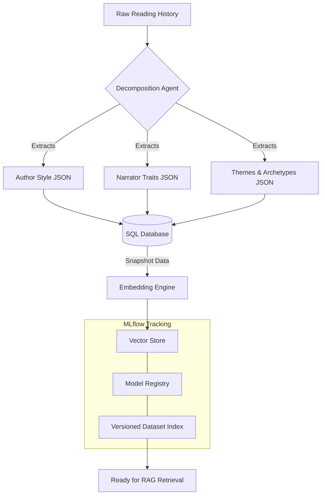
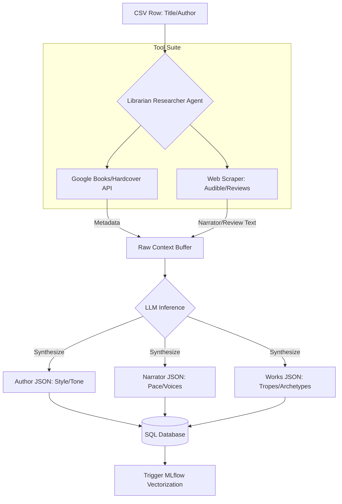

# Ingestion & Creation Stage

## High Level Flow

```mermaid
graph TD
    %% Input Source
    A[Raw Reading History] --> B{Decomposition Agent}

    %% Decomposition Logic
    B -->|Extracts| B1[Author Style JSON]
    B -->|Extracts| B2[Narrator Traits JSON]
    B -->|Extracts| B3[Themes & Archetypes JSON]

    %% SQL Storage
    B1 --> SQL[(SQL Database)]
    B2 --> SQL
    B3 --> SQL

    %% MLFlow & Vector Pipeline
    SQL -->|Snapshot Data| D[Embedding Engine]
    D --> E[Vector Store]

    subgraph MLflow Tracking
        E --- F[Model Registry]
        F --- G[Versioned Dataset Index]
    end

    %% The Output
    G --> H[Ready for RAG Retrieval]
```

## Zoom on Decomposition Agent

```mermaid
graph TD
    A[CSV Row: Title/Author] --> B{Librarian Researcher Agent}

    %% Tool Stage
    subgraph Tool Suite
        B --> C[Google Books/Hardcover API]
        B --> D[Web Scraper: Audible/Reviews]
    end

    C -->|Metadata| E[Raw Context Buffer]
    D -->|Narrator/Review Text| E

    %% Processing Stage
    E --> F{LLM Inference}
    F -->|Synthesize| G[Author JSON: Style/Tone]
    F -->|Synthesize| H[Narrator JSON: Pace/Voices]
    F -->|Synthesize| I[Works JSON: Tropes/Archetypes]

    %% Storage Stage
    G & H & I --> J[(SQL Database)]
    J --> K[Trigger MLflow Vectorization]
```
